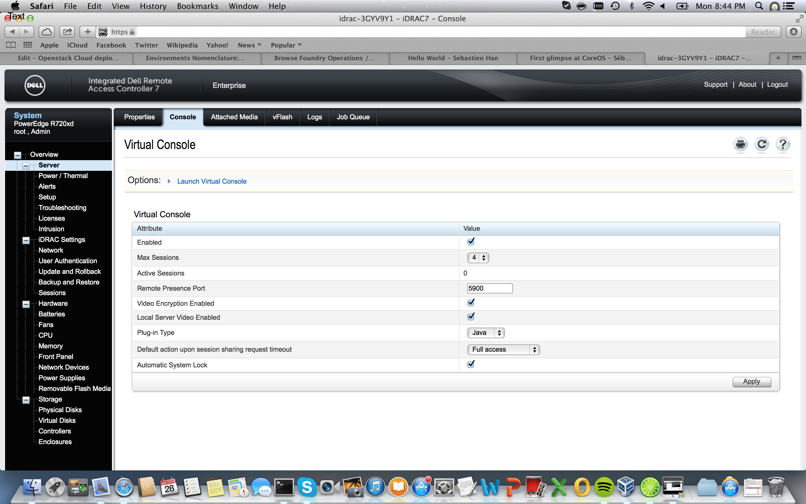

Prepare Your OPS Node
=====================

This step also includes installing Ubuntu on the OPS node, configuring the initial administrator user and configuring initial networking.

1. Install Ubuntu OS on the OPS Node.  (Using Virtual Console from the iDRAC web GUI).

Note: Only for OPS node, perform the above step on Windows.  Open the virtual console, select the virtual mdeia tab and click lauch Virtual Media.  This will open a new box, where you can select the folder in the your workstation that has the ubuntu installation iso.  Once done, check the "Mapped" box and keep the dialog box open until the Ubuntu install.  Now Select the net boot to "Virtual CD/DVD/ISO" and reboot the box.

During installation set OPS Node to these values:
(they have to be consistent with the zone file variables)

Hostname: ops1.zone1.example.com (orchestrator+mgmt_domain from the zone file)
Network configuration::

  eth0 (mgmt_interface from the zone file):
    ip address: 10.100.1.10 (puppet_address from the zone file)
    network: 255.255.255.0 (mgmt_network from the zone file)
    gateway: 10.100.1.1 (mgmt_gateway from the zone file)
    dns server: 8.8.8.8 (external_dns from the zone file)

2. Check connectivity

Check if you can reach gateway and the Internet from ops1:

.. code:: bash

  $ root@ops1:~# ping 10.100.1.1
  $ root@ops1:~# ping google.com

3. Deploy Occam on the Ops Node:

.. code:: bash
  
  % OPSUSERNAME='root' OPSPASSWORD='secretpassword' OC_ENVIRONMENT=testing ZONEFILE=yourzone rake occam:deploy_initial\[10.100.1.10\]

Where:

* OPSUSERNAME - username on ops1 node
* OPSPASSWORD - password for OPSUSERNAME
* OC_ENVIRONMENT - name of your puppet environment, usually testing or production
* ZONEFILE - zone configuration file from **puppet/hiera/zones** directory without .yaml extension. Puppet on ops node uses this information to read configuration. You can have many zones within one Occam project
* 10.100.1.10 - ip address of ops node

This rake task will package and transfer Occam folder to /var/puppet/environments/$OC_ENVIRONMENT/ on ops node and then install and configure all ops services like puppet, hiera, etc.

4. Validate Occam deploy on Ops Node:

.. code:: bash

      $ root@ops1:~# netstat -ntlp

5. Boot Controller and compute nodes.
#. Login to Controller after successful boot and validate nova services:

.. code:: bash

	$ root@ctrl1:~# nova-manage service list
        Binary           Host                                 Zone             Status     State Updated_At
        nova-consoleauth ctrl1                                internal         enabled    :-)   2013-10-20 19:40:28
        nova-scheduler   ctrl1                                internal         enabled    :-)   2013-10-20 19:40:28
        nova-conductor   ctrl1                                internal         enabled    :-)   2013-10-20 19:40:25
        nova-compute     comp1                                nova             enabled    :-)   2013-10-19 22:31:42
        nova-cert        ctrl1                                internal         enabled    :-)   2013-10-20 19:40:28

