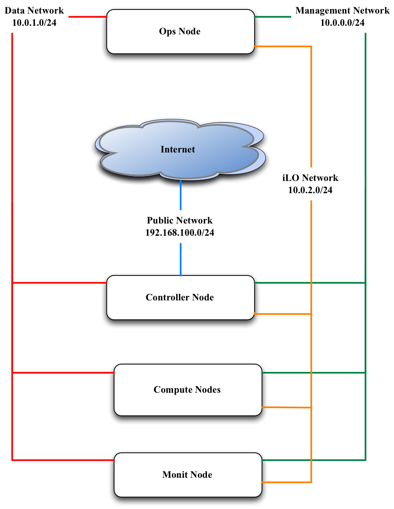

Cabling and Networking
======================

The first step is always to cable and setup the networking as you can only then define how you configure Occam. We recommend running **at least 5 servers** for your OpenStack cloud. (Note: If you choose to use high-availability feature, you will need to add 2 more servers.)

With 5 servers you will have the following breakdown of your nodes:

+ **Ops Node**
+ **Controller Node**
+ **2 Compute nodes**
+ **Monitor Node**

You will need to configure four networks.

+------------------------+----------------------------------------------------------------------------------------------------------------------+
| **iLO Network**        |  Most servers come with a dedicated remote console port known as Integrated Lights Out (iLO). This network is        |
|                        |  responsible for pre-configuration and PXE booting.                                                                  |
+------------------------+----------------------------------------------------------------------------------------------------------------------+
| **Management Network** |  This network is responsible for all service level traffic for any management node (e.g. ops, controller, compute).  |
+------------------------+----------------------------------------------------------------------------------------------------------------------+
| **Public Network**     |  This network is responsible for all northbound APIs.                                                                |
+------------------------+----------------------------------------------------------------------------------------------------------------------+
| **Private Network**    |  This network is responible for all VM and volume traffic.                                                           |
+------------------------+----------------------------------------------------------------------------------------------------------------------+

Now we will go into how you need to cable these servers and also how to setup the necessary networking on both the router and the switch.

Cable Your Servers
==================

Follow these steps to cable your servers:

#. Connect the iLO interfaces of the servers to one set of ports on the switch (usually dedicated ports, see your own documentation)
#. Select and take note of a set of ports on the switch that you would like to handle the Management Network. Connect all of these ports to the **eth0** interface on the servers.
#. Decide which nodes will act as your controller, ops and monitor node. You will need this information later.
#. Connect the **eth1** interface on the controller node to the switch. Take note of the port on the switch. It will serve the Public Network.
#. Connect one twinax interface of each server to the switch and make note of the ports on the switch. Note: the specific interface on the server will vary on the vendor. For our servers, it was **eth5** but you will need to confirm which specific interface it will be on your servers.
#. Connect one interface from the router to the switch. Make note of the port you use on both the router and the switch.

Configure The Router And Switch
===============================

The router will have the gateways for the Management and Public Network configured along with VLAN tags created. Make sure that these networks can reach out to the internet using NATing.

Below you will find examples for how to configure the router and switch. In these examples we are assuming that the router is Juniper MX-240 and the switch is Arista 7050.

The examples also assume these assignments for the various networks:

+--------------------+-------------------+--------------+
| Network            | IP Range          | VLAN Tag     |
+====================+===================+==============+
| Management Network |  10.100.1.0/24    | 100          |
+--------------------+-------------------+--------------+
| Public Network     |  10.101.2.0/24    | 200          |
+--------------------+-------------------+--------------+
| Private Network    |  172.20.1.0/24    | 300          |
+--------------------+-------------------+--------------+
| iLO Network        |  10.0.2.0/24      | 400          |
+--------------------+-------------------+--------------+

It is also assumed that the interface on router which connected to switch is **ge-0/2/0**.

Preparation
-----------

Make note of the port that the cable from the router to the switch is connecting to the router. Using this port you will be able to identify which interface that you need to configure. Please see the documentation for your specific router to how you can identify the interface name via the port.

Configure The Gateways
----------------------

The interface that is connected to the switch will need to have two gateways configured, one to support the management and one to support the Floating IP network (Public Network).

Note: The Public network may be an actual public network or you can create a pseudo "Public Network". A pseudo “Public Network” uses a private IP range that NATs all outbound traffic through a single Public IP. Of course specify two different gateway IPs for these. :-)

.. code:: bash

	user@host# edit
	user@host# set interfaces ge-0/2/0 unit 100 description "Link for Management Network"
	user@host# set interfaces ge-0/2/0 unit 100 vlan-id 100
	user@host# set interfaces ge-0/2/0 unit 100 family inet address 10.100.1.1/24
	user@host# set interfaces ge-0/2/0 unit 200 description "Link for Public Network"
	user@host# set interfaces ge-0/2/0 unit 200 vlan-id 200
	user@host# set interfaces ge-0/2/0 unit 200 family inet address 10.101.2.1/24

This should return something like this:

.. code:: bash

  user@host# show interfaces ge-0/2/0

  ge-0/2/0 {
    unit 100 {
      description "Link for Management Network";
      vlan-id 100;
      family inet {
        address 10.100.1.1/24;
      }
    }
    unit 200 {
      description "Link for Public Network";
      vlan-id 200;
      family inet {
        address 10.101.2.1/24;
      }
    }
  }

Configure The NAT Pool
----------------------

Configure NAT pool so that private networks can route out to the internet. This allows a single Public IP to handle outbound traffic to the internet. This is called Source-NAT with single IP.  You can choose any label for your Pool Name. In our example, we use NAT-POOL

.. code:: bash

	user@host# edit
	user@host# set services nat pool NAT-POOL address <your public IP>/32
	user@host# set services nat pool NAT-POOL port automatic

This should return something like this:

.. code:: bash

  user@host# edit services nat pool NAT-POOL
  user@host# show

  address <your public IP>/32;
  port {
    automatic;
  }

Configure The NAT Rules
-----------------------

Configure NAT rules for the source pool that was just created. These rules enable your Management and Public Networks to reach the internet. You can choose any label for your NAT rule. In this example we will use NAT-RULE:

.. code:: bash

	user@host# set services nat rule NAT-RULE match-direction input
	user@host# set services nat rule NAT-RULE term NAT from source-address 10.100.1.0/24
	user@host# set services nat rule NAT-RULE term NAT from source-address 10.101.2.0/24
	user@host# set services nat rule NAT-RULE term NAT then translated source-pool NAT-POOL
	user@host# set services nat rule NAT-RULE term NAT then translated translation-type napt-44
	user@host# set services nat rule NAT-RULE term NAT then translated mapping-type endpoint-independent
	user@host# set services nat rule NAT-RULE term NAT then translated filtering-type endpoint-independent

	user@host# set services nat rule NAT-RULE term Private from source-address 10.100.1.0/24
	user@host# set services nat rule NAT-RULE term Private from source-address 10.101.2.0/24
	user@host# set services nat rule NAT-RULE term Private from destination-address 10.100.1.0/24
	user@host# set services nat rule NAT-RULE term Private from destination-address 10.101.2.0/24
	user@host# set services nat rule NAT-RULE term Private then no-translation

This should return something like this:

.. code:: bash

  user@host# edit services nat rule NAT-RULE
  user@host# show

  match-direction input;

  term NAT {
    from {
      source-address {
        10.100.1.0/24;
        10.101.2.0/24;
      }
    }
    then {
      translated {
        source-pool NAT-POOL;
          translation-type {
            napt-44;
          }
          mapping-type endpoint-independent;
          filtering-type {
            endpoint-independent;
          }
        }
      }
    }
  }

  term Private {
    from {
      source-address {
        10.100.1.0/24;
        10.101.2.0/24;
      }
    }
    then {
      translated {
        source-pool NAT-POOL;
          translation-type {
          napt-44;
        }
        mapping-type endpoint-independent;
        filtering-type {
          endpoint-independent;
        }
      }
    }
  }

Configure the Switch
====================

(Fix this section)
Create the vlan tags for iLO and VM Traffic Network

.. code:: bash

	user@host (config)# vlan 300
	user@host(config-vlan-300)# exit
	user@host (config)# vlan 400
	user@host(config-vlan-400)# exit

The switch will have virtual interfaces for the gateways of the VM and iLO networks. Apply the corresponding vlan tags to the iLO interfaces and VM Traffic interfaces. These will be access ports. See below for example of access port configuration.

Since the vlan tags for Management and Public Networks were created on the router, take note of them and assign the same vlan tags on the switch. The port on the switch that is connected to the router should be configured as a trunk port. In the example below we used 300 and 301 respectively. Assuming interface 48 on the switch as the port connected to the router, run the following commands:

.. code:: bash

	user@host (config)# int eth48
	user@host (config-if-Et48)# switchport mode trunk
	user@host (config-if-Et48)# switch port trunk allowed vlan add 100,200
	user@host (config-if-Et48)# exit

On the ports connected to iLO, simply configure the switch as access ports and assign a vlan tag.  This vlan tag cannot be the same as the vlan tags used for the port trunk. Assuming two ports for iLO (1,2) and two ports VM Traffic (10,11):

.. code:: bash

	user@host (config)# int eth 1-2
	user@host (config-if-Et1-2)# description "Configuration for iLO, VLAN 400, 10.0.2.0/24"
	user@host (config-if-Et1-2)# switchport access vlan 400
	user@host (config-if-Et1-2)# exit

	user@host (config)# int eth 10-11
	user@host (config-if-Et10-11)# description "Configuration for VM Traffic, VLAN 300, 172.20.1.0/24"
	user@host (config-if-Et10-11)# switchport access vlan 300
	user@host (config-if-Et10-11)# exit

On the ports connected to MGMT, since we will want to PXE boot, we will need to configure as access ports and make sure spanning-tree port fast is enabled. This keeps the port open long enough for PXE booting to occur.  Assuming two ports for the Management Network, ports 20 and 21, we run these commands:

.. code:: bash

	user@host (config)# int eth 20-21
	user@host (config-if-Et20-21)# description "Configuration for Management Network, VLAN 100, 10.100.1.0/24"
	user@host (config-if-Et20-21)# switchport access vlan 100
	user@host (config-if-Et20-21)# spanning-tree portfast
	user@host (config-if-Et120-21)# exit

Configure The iLO IPs On The Servers
====================================

Now that we have the iLO network configured on the switch, we have to manually assign IP addresses to the servers for their dedicated iLO ports. You will have to consult your product manual on how to configure the iLO interface. There are different terms to refer to iLO and it largely depends on the vendor:

+--------+--------------------------------------------------+
| Vendor | Name of iLO Implementation                       |
+========+==================================================+
| HP     | iLO (Integrated Lights Out)                      |
+--------+--------------------------------------------------+
| Dell   | iDRAC (Integrated Dell Remote Access Controller) |
+--------+--------------------------------------------------+
| Quanta | IPMI                                             |
+--------+--------------------------------------------------+
| Cisco  | CIMC (Cisco Integrated Management Controller)    |
+--------+--------------------------------------------------+
| Intel  | RMM (Remote Management Module)                   |
+--------+--------------------------------------------------+
